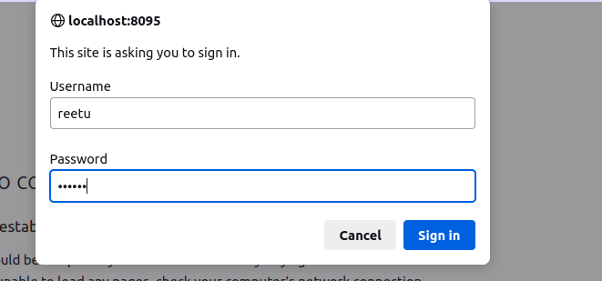

  
<u><h1 style="text-align:center">Installation of Nagios in Ubuntu 20.04 </h1></u>

<u><h2>Task requirement</h2></u></br>

Nagios is set up to monitor and track the health, performance, and availability of IT systems. It helps detect issues early, preventing downtime, and provides a centralized platform for efficient management and customization of alerts.

<u><h2 >Environment details </h2></u>
**OS**- Ubuntu 20.04 64-bit</br>
**CPU**- 8 Core (optional)</br>
  -   For small to medium-sized setups monitoring a few dozen hosts and services, a single-core CPU should be sufficient.

 -    Larger environments with hundreds or thousands of hosts and services may benefit from a multi-core CPU, such as a dual-core or quad-core processor.</br>
 
**Storage**- 1 TB (optional)</br>
**Memory**-  409Mib </br>
 -    For a small to medium-sized setup monitoring a few dozen hosts and services, a minimum of 1 GB to 2 GB of RAM is often sufficient.

 -   Larger environments with hundreds or thousands of hosts and services may require more RAM, ranging from 4 GB to 8 GB or more.

<u><h2 >Prerequisites tool </h2></u>

- Podman version 3.4.2 (This is optional otherwise,you can apply on base as well. )
  
<u><h3 >Firstly, install podman by following these commands: </h3></u>

First, use the source /etc/os-release command to get the OS release, as shown below</br>
```
source /etc/os-release
```
Since podman is not in the default Ubuntu 20.04 repository, we need to add the Kubic repository to be able to download the podman package. Then it can be installed using one of the package managers in Ubuntu, such as apt or apt-get. To add the repository, use the below command.
```
echo "deb https://download.opensuse.org/repositories/devel:/kubic:/libcontainers:/stable/xUbuntu_${VERSION_ID}/ /" | sudo tee /etc/apt/sources.list.d/devel:kubic:libcontainers:stable.list
```
If curl command is already installed then no need to install again.
```
sudo snap install curl
```


Then, use the command below to download and add the GPG key. This is needed to make sure the downloaded package is good.
```
curl -L "https://download.opensuse.org/repositories/devel:/kubic:/libcontainers:/stable/xUbuntu_${VERSION_ID}/Release.key" | sudo apt-key add -
```
After that update your system by this command.
```
sudo apt update
```
Now you can install podman by following command.

```
sudo apt install -y podman
```
**apt:** apt stands for "Advanced Package Tool. It is used to install, update, and manage software packages on ubuntu operating system.</br>

**install:** This is the sub-command that tells apt to install a package. When you use apt install, you're instructing the package manager to download and install the specified software.</br>

**-y:** This is an option flag that stands for "yes." It's used to automatically answer "yes" to any prompts that may come up during the installation process.</br>        

**podman:** This is the name of the software package you want to install.

Here i am showing output of above process.

ritu@ritu-Standard-PC-Q35-ICH9-2009:~$ source /etc/os-release

ritu@ritu-Standard-PC-Q35-ICH9-2009:~$ echo "deb https://download.opensuse.org/repositories/devel:/kubic:/libcontainers:/stable/xUbuntu_${VERSION_ID}/ /" | sudo tee /etc/apt/sources.list.d/devel:kubic:libcontainers:stable.list

[sudo] password for ritu: 

deb https://download.opensuse.org/repositories/devel:/kubic:/libcontainers:/stable/xUbuntu_20.04/ /

ritu@ritu-Standard-PC-Q35-ICH9-2009:~$ sudo snap install curl

curl 8.1.2 from Wouter van Bommel (woutervb) installed

ritu@ritu-Standard-PC-Q35-ICH9-2009:~$ curl -L "https://download.opensuse.org/repositories/devel:/kubic:/libcontainers:/stable/xUbuntu_${VERSION_ID}/Release.key" | sudo apt-key add -

  % Total    % Received % Xferd  Average Speed   Time    Time     Time  Current
  
                                 Dload  Upload   Total   Spent    Left  Speed
                                 
100  1093  100  1093    0     0    940      0  0:00:01  0:00:01 --:--:--   940

OK

ritu@ritu-Standard-PC-Q35-ICH9-2009:~$ sudo apt update

Hit:1 http://security.ubuntu.com/ubuntu focal-security InRelease  

Hit:2 http://in.archive.ubuntu.com/ubuntu focal InRelease     

Get:3 https://download.opensuse.org/repositories/devel:/kubic:/libcontainers:/stable/xUbuntu_20.04  InRelease [1,642 B]

Get:4 http://in.archive.ubuntu.com/ubuntu focal-updates InRelease [114 kB]

Hit:5 http://in.archive.ubuntu.com/ubuntu focal-backports InRelease

Get:6 http://in.archive.ubuntu.com/ubuntu focal-updates/main amd64 Packages [2,980 kB]

Get:7 http://in.archive.ubuntu.com/ubuntu focal-updates/main i386 Packages [912 kB]

Get:8 http://in.archive.ubuntu.com/ubuntu focal-updates/main Translation-en [484 kB]

Get:9 http://in.archive.ubuntu.com/ubuntu focal-updates/restricted amd64 Packages [2,511 kB]

Get:10 http://in.archive.ubuntu.com/ubuntu focal-updates/restricted Translation-en [351 kB]

Get:11 http://in.archive.ubuntu.com/ubuntu focal-updates/universe amd64 Packages [1,133 kB]

Get:12 http://in.archive.ubuntu.com/ubuntu focal-updates/universe i386 Packages [756 kB]

Get:13 http://in.archive.ubuntu.com/ubuntu focal-updates/universe Translation-en [270 kB]

Fetched 9,512 kB in 7s (1,334 kB/s)     

Reading package lists... Done

Building dependency tree   

Reading state information... Done

3 packages can be upgraded. Run 'apt list --upgradable' to see them.

ritu@ritu-Standard-PC-Q35-ICH9-2009:~$ sudo apt install -y podman

Reading package lists... Done

Building dependency tree  

Reading state information... Done

The following additional packages will be installed:

  catatonit conmon containernetworking-plugins containers-common criu crun
  
  fuse-overlayfs libnet1 libnftables1 libprotobuf-c1 podman-machine-cni
  
  podman-plugins slirp4netns uidmap
  
The following NEW packages will be installed:

  catatonit conmon containernetworking-plugins containers-common criu crun
  
  fuse-overlayfs libnet1 libnftables1 libprotobuf-c1 podman podman-machine-cni
  
  podman-plugins slirp4netns uidmap
  
0 upgraded, 15 newly installed, 0 to remove and 3 not upgraded.

Need to get 31.0 MB of archives.

After this operation, 153 MB of additional disk space will be used.

Get:1 http://in.archive.ubuntu.com/ubuntu focal/main amd64 libnet1 amd64 1.1.6+dfsg-3.1build1 [43.3 kB]

Get:3 http://in.archive.ubuntu.com/ubuntu focal/universe amd64 libnftables1 amd64 0.9.3-2 [229 kB]

Get:4 https://download.opensuse.org/repositories/devel:/kubic:/libcontainers:/stable/xUbuntu_20.04  conmon 100:2.1.2~0 [33.7 kB]

Get:5 https://download.opensuse.org/repositories/devel:/kubic:/libcontainers:/stable/xUbuntu_20.04  containers-common 100:1-22 [52.4 kB]

Get:7 http://in.archive.ubuntu.com/ubuntu focal-updates/universe amd64 libprotobuf-c1 amd64 1.3.3-1ubuntu0.1 [19.3 kB]

Get:8 http://in.archive.ubuntu.com/ubuntu focal-updates/universe amd64 uidmap amd64 1:4.8.1-1ubuntu5.20.04.4 [26.4 kB]

Get:10 https://download.opensuse.org/repositories/devel:/kubic:/libcontainers:/stable/xUbuntu_20.04  fuse-overlayfs 100:1.5.0-2 [41.8 kB]

Get:2 https://mirror.aardsoft.fi/opensuse/repositories/devel:/kubic:/libcontainers:/stable/xUbuntu_20.04  catatonit 0.1.7-1 [275 kB]

Get:6 https://mirror.aardsoft.fi/opensuse/repositories/devel:/kubic:/libcontainers:/stable/xUbuntu_20.04  criu 3.18-1 [703 kB]

Get:9 https://mirror.aardsoft.fi/opensuse/repositories/devel:/kubic:/libcontainers:/stable/xUbuntu_20.04  crun 100:1.2-2 [252 kB]

Get:11 https://mirror.aardsoft.fi/opensuse/repositories/devel:/kubic:/libcontainers:/stable/xUbuntu_20.04  podman-plugins 100:1.2.0-1 [1,116 kB]

Get:12 https://mirror.aardsoft.fi/opensuse/repositories/devel:/kubic:/libcontainers:/stable/xUbuntu_20.04  podman-machine-cni 100:0.0.0-1 [1,821 kB]

Get:13 https://mirror.aardsoft.fi/opensuse/repositories/devel:/kubic:/libcontainers:/stable/xUbuntu_20.04  podman 100:3.4.2-5 [18.7 MB]

Get:14 https://mirror.aardsoft.fi/opensuse/repositories/devel:/kubic:/libcontainers:/stable/xUbuntu_20.04  slirp4netns 100:1.1.8-4 [708 kB]

Get:15 https://mirror.aardsoft.fi/opensuse/repositories/devel:/kubic:/libcontainers:/stable/xUbuntu_20.04  containernetworking-plugins 100:1.1.1~1 [7,009 kB]

Fetched 31.0 MB in 1min 27s (358 kB/s)  

Selecting previously unselected package catatonit.

(Reading database ... 179273 files and directories currently installed.)

Preparing to unpack .../00-catatonit_0.1.7-1_amd64.deb ...

Unpacking catatonit (0.1.7-1) ...

Selecting previously unselected package conmon.

Preparing to unpack .../01-conmon_100%3a2.1.2~0_amd64.deb ...

Unpacking conmon (100:2.1.2~0) ...

Selecting previously unselected package containers-common.

Preparing to unpack .../02-containers-common_100%3a1-22_all.deb ...

Unpacking containers-common (100:1-22) ...

Selecting previously unselected package libnet1:amd64.

Preparing to unpack .../03-libnet1_1.1.6+dfsg-3.1build1_amd64.deb ...

Unpacking libnet1:amd64 (1.1.6+dfsg-3.1build1) ...

Selecting previously unselected package libnftables1:amd64.

Preparing to unpack .../04-libnftables1_0.9.3-2_amd64.deb ...

Unpacking libnftables1:amd64 (0.9.3-2) ...

Selecting previously unselected package libprotobuf-c1:amd64.

Preparing to unpack .../05-libprotobuf-c1_1.3.3-1ubuntu0.1_amd64.deb ...

Unpacking libprotobuf-c1:amd64 (1.3.3-1ubuntu0.1) ...

Selecting previously unselected package criu.

Preparing to unpack .../06-criu_3.18-1_amd64.deb ...

Unpacking criu (3.18-1) ...

Selecting previously unselected package crun.

Preparing to unpack .../07-crun_100%3a1.2-2_amd64.deb ...

Unpacking crun (100:1.2-2) ...

Selecting previously unselected package fuse-overlayfs.

Preparing to unpack .../08-fuse-overlayfs_100%3a1.5.0-2_amd64.deb ...

Unpacking fuse-overlayfs (100:1.5.0-2) ...

Selecting previously unselected package podman-plugins.

Preparing to unpack .../09-podman-plugins_100%3a1.2.0-1_amd64.deb ...

Unpacking podman-plugins (100:1.2.0-1) ...

Selecting previously unselected package podman-machine-cni.

Preparing to unpack .../10-podman-machine-cni_100%3a0.0.0-1_amd64.deb ...

Unpacking podman-machine-cni (100:0.0.0-1) ...

Selecting previously unselected package podman.

Preparing to unpack .../11-podman_100%3a3.4.2-5_amd64.deb ...

Unpacking podman (100:3.4.2-5) ...

Selecting previously unselected package slirp4netns.

Preparing to unpack .../12-slirp4netns_100%3a1.1.8-4_amd64.deb ...

Unpacking slirp4netns (100:1.1.8-4) ...

Selecting previously unselected package uidmap.

Preparing to unpack .../13-uidmap_1%3a4.8.1-1ubuntu5.20.04.4_amd64.deb ...

Unpacking uidmap (1:4.8.1-1ubuntu5.20.04.4) ...

Selecting previously unselected package containernetworking-plugins.

Preparing to unpack .../14-containernetworking-plugins_100%3a1.1.1~1_amd64.deb .

Unpacking containernetworking-plugins (100:1.1.1~1) ...

Setting up libnftables1:amd64 (0.9.3-2) ...

Setting up slirp4netns (100:1.1.8-4) ...

Setting up uidmap (1:4.8.1-1ubuntu5.20.04.4) ...

Setting up libnet1:amd64 (1.1.6+dfsg-3.1build1) ...

Setting up libprotobuf-c1:amd64 (1.3.3-1ubuntu0.1) ...

Setting up podman-machine-cni (100:0.0.0-1) ...

Setting up conmon (100:2.1.2~0) ...

Setting up containernetworking-plugins (100:1.1.1~1) ...

Setting up catatonit (0.1.7-1) ...

Setting up containers-common (100:1-22) ...

Setting up podman-plugins (100:1.2.0-1) ...

Setting up criu (3.18-1) ...

Setting up fuse-overlayfs (100:1.5.0-2) ...

Setting up crun (100:1.2-2) ...

Setting up podman (100:3.4.2-5) ...

Processing triggers for libc-bin (2.31-0ubuntu9.12) ...

Processing triggers for man-db (2.9.1-1) ..


After installation of podman you can check by this command.
```
podman -v
```
```
systemctl enable podman
```

```
systemctl status podman
```
**systemctl:**	It is a command-line tool for managing system services.

**status:**	This is a subcommand of systemctl that displays the status of a system service.

**podman:**	Name of the system service to check the status.

ritu@ritu-Standard-PC-Q35-ICH9-2009:~$ podman -v

podman version 3.4.2

ritu@ritu-Standard-PC-Q35-ICH9-2009:~$ systemctl enable podman

ritu@ritu-Standard-PC-Q35-ICH9-2009:~$ systemctl status podman

● podman.service - Podman API Service

     Loaded: loaded (/lib/systemd/system/podman.service; enabled; vendor preset>
     
     Active: inactive (dead) since Tue 2023-11-21 10:32:51 IST; 2h 7min ago
     
TriggeredBy: ● podman.socket

       Docs: man:podman-system-service(1)
       
   Main PID: 553 (code=exited, status=0/SUCCESS)


#### Command :-
This command will query the default container registry (usually Docker Hub) and return a list of container images with "nagios" in their name or description.
```
podman search nagios
```


**podman:** It is the name of the containerization tool.</br>

**search:** It is a subcommand in a podman tool, it indicates that you want to search for container image images in container registry.</br>

**nagios:** It is search term or query, here I am  looking for container images related to the Nagios monitoring tool.</br>

#### Command :-
This comand is used to pull the nagios container image from docker hub to your local system using podman.
```
podman pull docker.io/jasonrivers/nagios  
```


**podman pull:** It tells your computer to download something.</br>

**docker.io:** It's the location on the internet where we want to get something.</br>

**jasonrivers/nagios:** This specifies exactly what we want to download, in this case, it's a tool or application called "nagios."</br>


#### Command :- 
This command will start the Nagios container with the specified options. You can access the Nagios web interface by opening a web browser and navigating to http://localhost:8095/nagios.</br> 
In this command I added my username and password also otherwise nagios will give you default username and password.

```
 podman run -d --name nagios -p 8095:80 --cap-add=NET_RAW -e NAGIOSADMIN_USER=reetu -e NAGIOSADMIN_PASSWORD=nagios docker.io/jasonrivers/nagios
 ```


**podman run:** It tells your computer to start running something in a container.</br>

**-d:** It stands for "detached mode." This means that the container will run in the background, and you'll get your command prompt back.</br>

**--name nagios:** This gives your container a name, in this case, "nagios." It's like giving it a label so you can refer to it easily.</br>

**-p 8095:80:** This maps port 8095 on your computer to port 80 in the container. So, when you access port 8095 on your computer, it's like talking to port 80 in the container.</br>

**--cap-add=NET_RAW:** This adds the capability to send and receive raw network packets. It's needed for certain network-related tasks.

**-e NAGIOSADMIN_USER=reetu:** This sets an environment variable NAGIOSADMIN_USER inside the container to "reetu." It's like giving a piece of information to the container.</br>

**-e NAGIOSADMIN_PASSWORD=nagios:** This sets another environment variable NAGIOSADMIN_PASSWORD inside the container to "nagios." It's like giving another piece of information to the container.</br>

**docker.io/jasonrivers/nagios:** This is the name of the container image you want to run. It's like specifying which application or tool you want to use in the container.</br>

#### Command  :-
 Check running container details by this command.
 ```
podman ps
```

**podman:** This is the command-line tool for managing containers.</br>

**ps:** This is a subcommand of podman that stands for "processes" or "list containers."</br>

**If you have not given your username then u don't have need to follow below steps:**
#### Command :-
This command is used for going into the container and execute commands.
```
podman exec -it nagios bash
```


**podman exec:** Exec is the sub command of podman used for executing a command inside a running container.</br>

**-it:** It allows you to run interactive commands inside containers while maintaining a terminal-like environment for a smooth interactive experience.</br>

**nagios:** This is the name of the container where you want to execute the command. It specifies which container to enter.</br>

**bash:** This is the command you want to run inside the container. In this case, you are starting a Bash shell inside the container. Bash is a command-line shell that allows you to interact with the container's file system and execute commands within it.

#### Command :-
By this command, I am telling my computer to change my current working directory to the /opt/nagios/etc directory.

```
cd /opt/nagios/etc
```
**cd:** This is a command that stands for "change directory." It is used to navigate or move to a different directory (folder) in the file system.

**/opt/nagios/etc:** This is the path or location you want to change your current directory to. In this case, you are specifying the directory /opt/nagios/etc as the target directory.


#### Command :-
 It is used to list files and directories in a directory. It is one of the most commonly used commands in the command-line interface (CLI). 
```
ls
```

#### Command :- 
This command is used inside the container to use all commands.
```
apt-get update && apt-get upgrade
```
Then install vim command by using:
```
apt install vim
```

#### Command :-
This command is used  for editing in file.

```
vim cgi.cfg
```

Go to the cgi.cfg file and add your username which you have mentioned in run command.</BR>


**vim:** This is the name of a text editor program.

**cgi.cfg:**  This appears to be a filename or file path.


Type **localhost:8095** on web page and then you have to login by username and password.</br>




After login you will get Nagios dashboard like this:

 

#### Checking services
We have to go on left side and click on the service option.
This is the dashboard of all services.</br>


 


